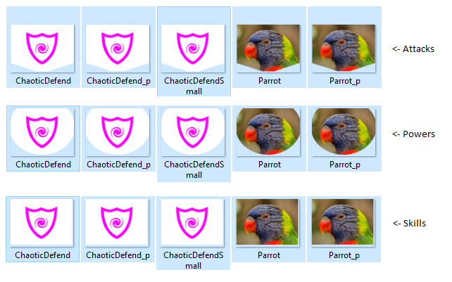

# StSModdingToolCardImagesCreator

This is the tool I created to help create images for [The Blackbeard Mod](https://github.com/JohnnyBazooka89/StSModTheBlackbeard). I hope it will be useful for other modders.

This tool takes 500x380 or 250x190 images and cuts them to fit into Slay the Spire cards. 

Specifically when processing images with size 500x380 it creates 6 versions of the image: Attack preview, Attack, Skill preview, Skill, Power preview and Power. When processing 250x190 with size 250x190 it creates 3 versions of the image: Attack, Skill and Power.

Usually it is enough to provide just the image with size 500x380, but in case of vector graphics or texts the automatic 50% scaling can look pretty bad, then it is advised to also provide 250x190 version of the image. You can compare ChaoticDefend.png to ChaoticDefendSmall.png, to see the difference.

This screenshot shows example files generated by the tool:

To use the tool, simply download the newest [release](https://github.com/JohnnyBazooka89/StSModdingToolCardImagesCreator/releases), then copy images you want to process into the folder "cards" and open "run.bat". The tool creates a new folder named "images" and inside it there will be 3 folders: "Attacks", "Powers" and "Skills". Copy the files you need into your mod. That's all!  